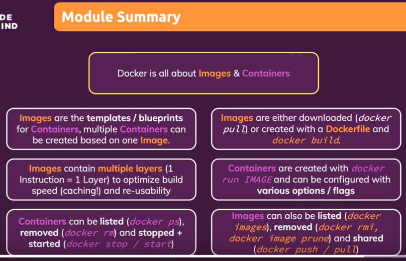
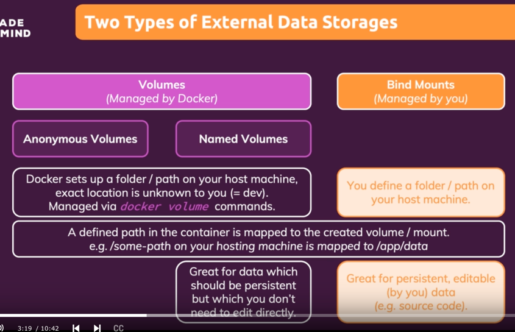

## Docker setup overview
Linux operating systems natively support containers


## An overview of docker tools


## Getting our hands dirty
launch docker daemon

_Dockerfile_
```dockerfile
FROM node:14

WORKDIR /app

COPY package.json .

RUN npm install

COPY . .

EXPOSE 3000

CMD ["node", "app.mjs"]
```

_app.mjs_
```javascript
import express from 'express'
import connectToDatabase from "./helpers.mjs"

const app = express()

app.get('/', (req, res) => {
    res.send('<h2>Hi there</h2>')
})

await connectToDatabase()

app.listen(3000);
```

don't `npm i`  
do:
`
docker build .
docker run -p 3000:3000 <image id>`  (command)
`-p` - publish port


`docker ps` - list containers (command)
`docker stop <image name>` - stop container (command)

## Course outline


## Images & Containers: What and Why?

*Container* small packages contain application and entire environment.
It runs code

*Image* contains code and tools to execute code


_Image_ is a template and _container_ is a running instance of image


## Using & Running External (Pre-Built) Images
https://hub.docker.com/_/node
`docker run node` - will utilize _node_ image to run container based on this image (command)


`docker ps -a` show all containers

`docker run -it node` - expose containers terminal (command)
`-it` - interactive mode - expose containers mode

## Building our own Image with a Dockerfile
```dockerfile
COPY . /app
```
first `.` - path to copy from starting from location of Dockerfile
second `/app` - where to store inside image

---
by default commands run from root folder of the image
We have to specify _WORKDIR_ - set where commands should run from. All subsequent commands will be executed from inside specified path
```dockerfile
WORKDIR /app
RUN npm install
```

Also, since we changed our working directory, we can copy to /app by:
```dockerfile
COPY . ./
```
here second `.` is now `/app`.
This is equivalent to specifying absolute path:
```dockerfile
COPY . /app
```
It's better to use absolute paths

---
_RUN_ - commands to create an image
_CMD_ - commands to start in the container

_CMD_ - execute command when the container is started

If we don't specify _CMD_ , the _CMD_ of base image will be executed. If not _CMD_ in base image, we get an error

---

Container is isolated from our local machine
We must explicitly expose

_Dockerfile_ (all)
```dockerfile
FROM node

WORKDIR /app

COPY . /app

RUN npm install

EXPOSE 80

CMD ["node", "server.js"]
```

## Running a Container based on our own Image
Build and run:
`docker build .` - create image based on Dockerfile (command)
`docker run <image id>`

stop container:
`docker ps
docker stop <image name>`

`docker ps -a` - see all containers

---
```dockerfile
EXPOSE 80
```
Just tells which port should be exposed

To be able to access port, we must use flag `-p` in console
`docker run -p 3000:80 <image name>`

## Images are read-only
When we change code form which we build image, we must build a completely new image
`docker build .`

## Understanding image layers
Every instruction creates layer
Only commands which have changes due to changes are executed, all previous steps in Dockerfile skipped, They are cached

Optimization: 
copy package.json => install => copy rest of code

```dockerfile
FROM node

WORKDIR /app

COPY package.json /app

RUN npm install

COPY . /app

EXPOSE 80

CMD ["node", "server.js"]
```

## Managing images and containers


`docker --help`\
`--help` - see help on command\

## Stopping & restarting containers
`docker run <image name>` - running new container\
`docker stop <container name>`\
`docker start <container name>` - reuse already built container

## Understanding Attached & Detached Containers
(commands):
`docker start <container name>` - start already existing container in _detached_ mode  
`docker attach <container name>` - attach already existing and running container

`docker run -p 3000:80 <image name>` - start new container in _attached_ mode  
`docker run -p 3000:80 -d <image name>` - start new container in _detached_ mode  
_attached_ mode - we listen to the output of the container, we see logs of container in real time

`docker logs <container name>` - see containers previous logs
`docker logs -f <container name>` - see containers logs in real time
`-f` - follow mode

`docker start -a <container name>` - start container in attached mode

## Entering interactive mode
```python
from random import randint

min_number = int(input('Please enter the min number:'))
max_number = int(input('Please enter the max number:'))

if(max_number < min_number):
  print('Invalid input')
else:
  rnd_number = randint(min_number, max_number)
  print(rnd_number)
```

```dockerfile
FROM python
WORKDIR /app
COPY . /app
CMD ["python", "rng.py"]
```
`docker run build .`
We can't input into container, we're not in interactive mode:


`docker run --help`
`-i` - interactive mode. Container will listen to input
`-t` - allocate pseudo TTY. Container will provide input

`docker run -it <image id>`

---
To start a container that we can type to container's input, we can start in _attached_ mode
`docker start -a <container name>`  
Behavior is strange: we can input only once

We need `-i` because of interactive mode
`docker start -ai <container name>`

## Deleting Images & Containers
`docker ps -a` - list all containers
`docker rm <container name>` - remove container (can remove only stopped container)
`docker container prune` - remove all stopped containers
`docker images` - list all images
`docker rmi <image id>` - remove image. Can be removed only if not use by any container (including stopped containers)
`docker image prune -a` - remove all unused images

## Removing stopped containers automatically
`docker run -p 3000:80 -d --rm <image name>`
`--rm` - remove container once stopped

## A Look Behind the Scenes: Inspecting Images
`docker image inspect <image id>`

## Copying Files Into & From A Container
Copy files between containers and localhost
copy files into a running container 
`cp <path copy from> <container name>:/<path to copy to>`
Might be useful for configuration files

or out of container
`cp <container name>:/<path to copy to> <path copy from>`
Might be useful for log files

## Naming & Tagging Containers and Images
`docker run --help`
`--name`
`docker run -p 3000:80 -d --rm --name <container name> <image id>`

`docker run -p 3000:80 -d --rm --name goalsapp vds897v9f8sd`
now we can use name:
`docker start goalsapp`

---
name for images are tags:
`name:tag`
`docker build -t <name>:<tag> .`


`docker build -t goals:latest .`

## Sharing images: overview
  

## Pushing images to dockerhub

https://hub.docker.com/
create repository

give local image a name:
1) or build image again with given tag
2) we can make clone of existing image:
`docker tag <image name|id> <new image name (same as repository name)>`
   
login to repository:
`docker login --usernma <docker username>`

push to repository
`docker push <new image name>`

## Pulling & Using Shared Images
Pull latest image
`docker pull <image name>`

If image doesn't exist locally, it will be downloaded:
`docker run <image name>`

## Module summary



https://dockerlabs.collabnix.com/docker/cheatsheet/

## Module introduction
- understanding different kinds of data
- images, containers & volumes
- using arguments & environment variables

## Understanding Data Categories / Different Kinds of Data


add new project _data_volumes_

## Building & Understanding the Demo App

```dockerfile
FROM node:14
WORKDIR /app
COPY package.json /app
RUN npm install
COPY . /app
EXPOSE 80
CMD ["node", "server.js"]
```
build image:
`docker build -t feedback-node .` -

run container:
`docker run feedback-node -p 3000:80 -d --name feedback-app --rm feedback-node`

go to localhost:3000
localhost:3000/feedback/<title>.html - see feedback

## Understanding the Problem

`docker stop feedback-app` when with `--rm`, we must recreate container and our file 'awesome.txt' is deleted  

We start new container without `--rm`:
`docker run feedback-node -p 3000:80 -d --name feedback-app feedback-node`
When stopping container without `--rm` the file is not deleted

Containers built on the same image are isolated from each other
We have to save data in such a way that it survived container deletion

## Introducing volumes

Volumes are folders not in the container but on the host machine which are mapped into containers (mounted)  
It's a two direction connection 
Volumes allow to persist data when container is removed  

## A First, Unsuccessful Try

In our app _feedback_ folder we want to persist  
Add instruction:
```dockerfile
VOLUME ["/app/feedback"]
```

`docker buid -t feedback-node:volumes .`
`docker run -d -p 3000:80 --rm --name feedback-app feedback-node:volumes`

---

Try to create feedback and we see error: _cross device link is not permitted_
This is because of `fs.rename` method because of `VOLUME` in docker will move the file outside or the container  
We can replace to
```javascript
await fs.copyFile(tempFilePath, finalFilePath);
await fs.unlink(tempFilePath);
```
Now we must delete our image and rebuild it
`docker rmi feedback-node:volumes`
`docker build -t feedback-node:volumes .`

create container with `--rm`
`docker run -d -p 3000:80 --rm --name feedback-app feedback-node:volumes`
Still data is not persisted for different containers


## Named Volumes To The Rescue!

List volumes
`docker volume ls`

Anonymous volumes exist as long as a container exists
We'll come back later where anonymous volumes can be helpful
For now we'll checkout _named_volumes_

Named volumes survive container remove

We don't create named volumes in Dockerfile

We create them in console while creating container
Remove `VOLUME` from Dockerfile

Create container with named volume `-v feedback:/app/feedback`  
Named volumes are not deleted when the container shuts down  
create new image:
`docker rmi feedback-node:volumes`
`docker build -t feedback-node:volumes .`
`docker run -d -p 3000:80 --rm --name feedback-app -v feedback:/app/feedback feedback-node:volumes`

After this if we create new container with the same volume name, data will persist after new container creation with the same volume name

---

Note: we don't know path to volumes on our machine  
## Getting Started With Bind Mounts (Code Sharing)

Problem: Changes on our source code are note reflected in running container. We must rebuild image


For bind mounts we define the path on our host machine. To do so, we need second `-v` flag:
`docker run -d -p 3000:80 --rm --name feedback-app -v feedback:/app/feedback -v "/Users/badger/Desktop/study/schwarzmuller-docker-kubernetes/data-volumes:/app" feedback-node:volumes`

And make sure folder is accessible by docker


But we see that container is immediately stopped (run without `--rm`)
`docker logs feedback-app`


## Combining & Merging Different Volumes
Problem with uninstalled packeges:
1) we execute Dockerfile and install dependencies
2) our bind mount replaces all content of image with our local content without installed depenedencies

We need to tell docker some parts should not be overwritten

Solution add another anonymous volume (without `:`) to cli:
`docker run -d -p 3000:80 --rm --name feedback-app -v feedback:/app/feedback -v "/Users/badger/Desktop/study/schwarzmuller-docker-kubernetes/data-volumes:/app" -v /app/node_modules feedback-node:volumes`

Here the more specific path `/app/node_modules` of 3rd -v wins over `/app` of 2nd -v

Now recreate container and now if we change source code and reload page, we cen see changes on our web page without rebuilding image  

## A NodeJS-specific Adjustment: Using Nodemon in a Container

_package.jsons_
```json
"scripts": {
  "start": "nodemon server.js"
},
"devDependencies": {
  "nodemon": "2.0.4"
}
```

_Dockerfile_
```javascript
CMD ["npm", "start"]
```

recreate container:
`docker rm feedback-app`
`docker rmi feedback-node:volumes`
`docker build -t feedback-node:volumes .`
`docker run -d -p 3000:80 --rm --name feedback-app -v feedback:/app/feedback -v "/Users/badger/Desktop/study/schwarzmuller-docker-kubernetes/data-volumes:/app" -v /app/node_modules feedback-node:volumes`

Now server should restart automatically whenever we change our source code for server

---

Note: for windows there it is not working like this

## Volumes & bind mounts: overview


## A Look at Read-Only Volumes
add `:ro`, `-v /app/temp` - to be able to write to /temp
`docker run -d -p 3000:80 --rm --name feedback-app -v feedback:/app/feedback -v "/Users/badger/Desktop/study/schwarzmuller-docker-kubernetes/data-volumes:/app:ro" -v /app/temp -v /app/node_modules feedback-node:volumes`

## Managing Docker Volumes

List volumes:
`docker volume ls`

We can create volume and use it in our subesequently created container:
`docker volume create feedback-filed`

Inspect volume 
`docker volume inspect feedback`

Delete unused volume in running container:
`docker volume rm feedback-files`

Remove all unused volumes:
`docker volume prune`

Anonymous volumes are removed if their container is removed

## Using "COPY" vs Bind Mounts

We bind mount during development to reflect our changes instantly

On the production server there is no connected source code that updates while it running  
That's why we create snapshot containers of our code with:
```dockerfile
COPY . .
```


